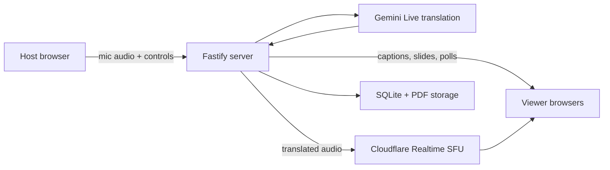

# Fluent

Fluent is a self-hosted platform for live, translated presentations. A host
speaks in one language while viewers follow a shared link for translated audio,
live captions, source subtitles, synchronized slides, polls, and reactions.

The backend keeps API keys on the server and opens one Gemini Live session per
talk. Cloudflare Realtime SFU can fan translated audio out to viewers, while
SQLite stores sessions and final transcripts.

## Features

- Shareable viewer, host, stage, and transcript views
- Live translated audio, translated captions, and source-language subtitles
- PDF, published Google Slides, and external HTML deck support
- Synchronized slides, polls, quizzes, reactions, and attendance analytics
- Local-disk or Cloudflare R2 storage for uploaded PDFs
- Admin-created presentation sessions
- Backup, restore, preflight, server smoke, and browser smoke tooling

## Architecture



The app is an npm-workspace monorepo:

- `client/`: React, Vite, Tailwind CSS, and Web Audio/WebRTC clients
- `server/`: Fastify, WebSocket rooms, Gemini integration, SQLite, and storage
- `scripts/`: verification, backup/restore, SFU checks, and R2 asset upload

Live rooms and Gemini connections are held in one Node.js process. Run one app
instance and do not deploy while a talk is active.

## Requirements

- Node.js 24 (see `.nvmrc`)
- npm
- A Gemini API key for live translation
- Chromium for the browser smoke suite
- Optional: Cloudflare Realtime SFU for viewer audio fanout
- Optional: Cloudflare R2 for uploaded PDFs and built assets

## Run locally

```bash
nvm use
npm ci
cp .env.example .env
npm run dev
```

Set `GEMINI_API_KEY` and replace the development `ADMIN_SECRET` in `.env`.
The API starts on port `3010`; Vite starts on port `5175` and proxies API,
WebSocket, and upload requests to the server.

Open `http://localhost:5175/new`, enter the admin secret, create a session, and
share the generated viewer URL. The server can boot without a Gemini key in
development, but translation will not work.

`better-sqlite3` is compiled for the active Node major version. After changing
Node versions, run `npm rebuild better-sqlite3` with Node 24 active if startup
reports an ABI or `NODE_MODULE_VERSION` error.

## Configuration

`.env.example` is the complete, commented configuration reference. The main
groups are:

| Purpose | Variables |
|---|---|
| Required in production | `GEMINI_API_KEY`, `ADMIN_SECRET` |
| App and persistence | `PUBLIC_ORIGIN`, `TRUST_PROXY`, `DATABASE_PATH`, `UPLOADS_DIR`, `PORT` |
| Viewer limits | `MAX_VIEWERS_PER_SESSION`, `PUBLIC_GET_MAX` |
| Cloudflare Realtime | `AUDIO_SUBSCRIPTION_ACTIVE`, `CF_REALTIME_APP_ID`, `CF_REALTIME_APP_SECRET` |
| Cloudflare R2/CDN | `R2_ACCOUNT_ID`, `R2_ACCESS_KEY_ID`, `R2_SECRET_ACCESS_KEY`, `R2_BUCKET`, `R2_PUBLIC_BASE_URL`, `R2_CACHE_PURGE_BASE_URLS`, `R2_CACHE_PURGE_ZONE_ID`, `R2_CACHE_PURGE_API_TOKEN`, `ASSET_CDN_BASE_URL` |
| Optional telemetry | `SENTRY_DSN`, `VITE_GA_MEASUREMENT_ID` |

Only `VITE_*` values are included in the client bundle. Never prefix server
credentials with `VITE_`.

Viewer audio is disabled unless `AUDIO_SUBSCRIPTION_ACTIVE=true`. Without
Cloudflare Realtime credentials, viewers still receive captions, subtitles,
slides, polls, and reactions.

## Build and verify

```bash
npm run typecheck
npm run build
npm run preflight
```

For the full release check, install Playwright Chromium once and run:

```bash
npx playwright install chromium
npm run verify
```

The full check scans the public release contents, builds both workspaces,
validates the deployment layout, audits dependencies, and runs server and
browser smoke tests.

## Deploy and operate

The included `render.yaml` runs Fluent as a single Render web service with a
persistent `/data` disk. Cloudflare services are optional and are configured
separately.

See [Deployment](docs/deployment.md) for the Render, Cloudflare Realtime, R2,
CDN, backup, and verification steps.

Before publishing a fork or mirror, follow [Public release and data
handling](docs/public-release.md). It covers ignored databases, uploads,
deployment secrets, generated assets, and Git history.

## Current constraints

- One app instance owns all live room state.
- A deployment or process restart ends any active Gemini session.
- Each session has one target language.
- Viewer audio depends on Cloudflare Realtime's WebSocket adapter, which is a
  beta API and may change.
- Browser audio routing and picture-in-picture support vary by platform.

## Contributing and security

Read [CONTRIBUTING.md](CONTRIBUTING.md) before opening a pull request. Report
security issues through the private process in [SECURITY.md](SECURITY.md), not
through a public issue.

## License

Fluent is available under the [MIT License](LICENSE).
